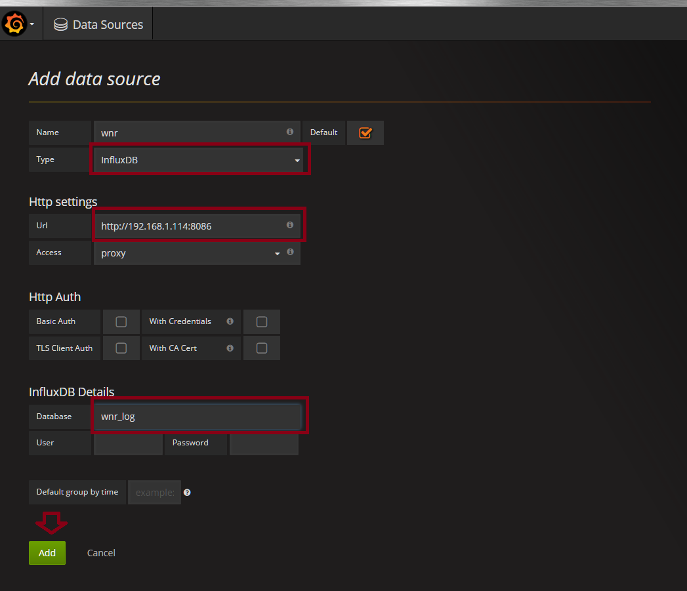
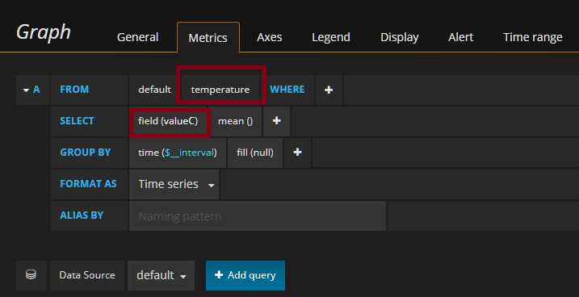
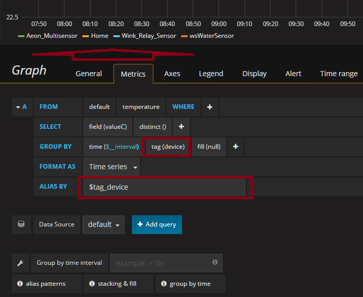
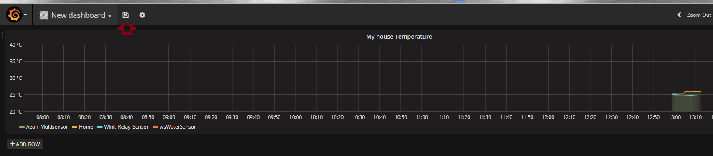
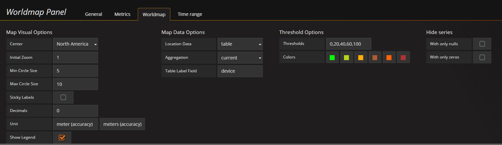

## Deploying Grafana and InfluxDB servers as docker containers on raspberry pi using docker orchestrate script.

#### This documentation assumes that you already have docker installed. I recoommend to use Hypriot OS (https://blog.hypriot.com/getting-started-with-docker-on-your-arm-device/)
#### Also, this documentation shows how to use host local folders for persistence. You can mount a NFS/CIFS/ISCSI file system to your host and use that instead. There are plenty resources on how to mount NAS storage on the internet.

### Steps:
for the purpose of this documentation I assume that you use default hypriot OS user is <b>pirate</b> if you use raspbian jessie and your user id is <b>pi</b> or anything else - adjust steps below accordingly.
Also my assumtion is that you know how to copy files to unix box or how to create and edit files using either 'vi' or 'nano' editors

1. login to rasperry pi as user pirate

2. navigate to home directory cd /home/pirate

3. create a folders where you will keep your influxDB and grafana Settings<br>
```
mkdir grafana
mkdir grafana/log
mkdir grafana/data
mkdir influxdb
mkdir influxdb/data
mkdir influxdb/config
```
6. get docker-compose.yaml from [docker-compose.yaml](docker-compose.yaml) , update it in case your userid or folders are different from what we did in step 3 and copy it (after you put your details) to /home/pirate folder. 

7. execute following command to install grafana and influx db in one step from /home/pirate folder of your raspberry pi box<br>
```
cd /home/pirate
docker-compose up -d

```

8. Once it is done, your grafana server and infulxdb should be up and running. you can verify that by executing 
```
docker container ls
```
you should see something similar to:
```
CONTAINER ID        IMAGE                           COMMAND                  CREATED             STATUS              PORTS                                         NAMES
a187de3ada6a        fg2it/grafana-armhf:v4.3.2      "/run.sh"                24 minutes ago      Up 24 minutes       0.0.0.0:3000->3000/tcp                        pirate_grafana_1
0de3a721e31f        tfatykhov/rpi-influxdb:latest   "/usr/bin/entry.sh..."   24 minutes ago      Up 24 minutes       0.0.0.0:8086->8086/tcp                        pirate_influxdb_1
```
9. Now you need to import updated flows for [winkCore](https://github.com/tfatykhov/WinkRedNode/blob/master/Flows/Bluemix/winkCore.json) and [tabletUI](https://github.com/tfatykhov/WinkRedNode/blob/master/Flows/Bluemix/tabletUI.json).

10. After import, navigate to /freeboard/ui, open configuration tab and fill "Grafana Server HostPort" with following: http://<ip_address_of_grafana_server>:8086 (for example: http://192.168.1.111:8086). Once you do that click submit and then "refresh wink data" which is important and required as it will try to create initial database in influx db server.

11. Once that is done, your WNR instance should start writing data into influxDB, and now it is time to configure grafana server and set a database connection. Navigate to http://<grafana_server_ip>:3000. When asked to enter user id and password use admin/grafana123 (this is default password and you can change it during installation step 6 by editing docker-compose.yaml).

12. Once you logged in, grafana will ask you to create a new data source. Click on that icon and you will see "create datasource" dialog. Populate it as shown on the image below but of course put your own ip address of grafana server. Do not use localhost! but put actual ip address: 


13. Click add and then Save and test. You should see successfull message

14. Next step is to create your first dashboard. Click on "new dashboard" and you will see first empty space and list of avaliable panels. Click on "Graph" and it should populate empty graph panel with no data. Click on "Panel Title" and then select "Edit". you will see a Graph configuration with "Metrics" tab opened. 

15. Click on "select measurement" and you will see list of stuff that WNR already populated in the database. As this is happening in real-time you may or may not see all measurements. Just give it some time and you should see everything. Let's assume you already have "temperature" avaliable as measurement, select it. Then click on value under select and choose which one you wnat to use between valueC (celcius) or valueF (Fahrenheit). At this time you should be able to see data appear in the graph. Click on mean(), select "remove", then click on "+" , select aggregates - distint(). This will give you each value. Of course you can play with various aggregations. They can give you bunch of different options depends on your needs. 


16. At this time you should see a chart with average temperature inside your house based on all sensors. It is calculated based on each sensor data automatically by grafana. Now let see how to get individual values for each sensor. For that click on "+" under "group by" line and select tag(device). Once you do that you should see individual values for all your sensors but lables are bit long. In order to make them looks better, type following in "alias by" field - $tag_device. At this point you should see proper labes for each your sensor with space in the name replaced by _.


17. After that, you should navigate to general tab so you can put proper header, then Axes where you can select proper units and labels for you axes, etc. More information is avaliable [here](http://docs.grafana.org/features/panels/graph/).

18. Once you do that, you should close graph settings and see your dashboard. Once you done, click on "save" icon so you dashboard will be saved.


19. There are several different panels that you can use so please experiment and get information about panels [here](http://docs.grafana.org/)

20. Only thing that is bit unclear - how to use world map panel with owntracks data. I am still looking into proper way of storing data so it can be used with this panel but for now please use configuration from images below. it will show you locations of each gps sensor with name and accuracy on mouse over.



